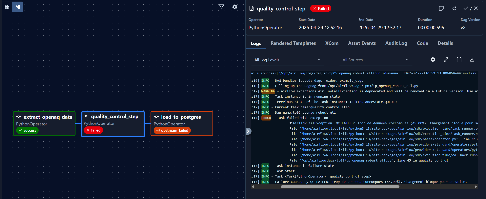
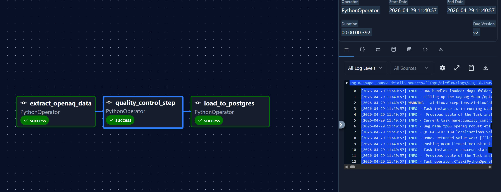

# TP 5 : Robustesse et Controle Qualite (OpenAQ)

Ce projet montre la mise en place d'un pipeline ETL capable de s'auto-controler et de resister aux erreurs reseau.

## 1. Le DAG Robuste
Le fichier source est localise dans le meme dossier : tp_openaq_robust_etl.py.

Points cles du code :
- Retries : 3 tentatives automatiques sur l'extraction API.
- Execution Timeout : Limite de 2 minutes par tache.
- Exception de securite : Utilisation de AirflowFailException pour stopper le pipeline sans retry en cas de donnees corrompues.

## 2. Description des controles qualite retenus
Trois niveaux de controle sont effectues avant d'autoriser l'ecriture en base :
1. Validation du schema : Verification de la presence de la cle results.
2. Validation Geographique : Filtrage des coordonnees GPS aberrantes (Latitude hors de [-90, 90] ou Longitude hors de [-180, 180]).
3. Validation d'identite : Suppression des enregistrements sans nom de station.
4. Seuil critique : Si plus de 40% du lot est invalide, le chargement est totalement bloque.

## 3. Preuve de l'execution (Succes)

Resultat des logs (QC PASSED) :
[2026-04-29 11:40:57] INFO - QC PASSED: 100 localisations valides sur 100.

## 4. Preuve de blocage (Donnees invalides)
Pour tester ce cas, nous avons simule des donnees corrompues. Le DAG s'arrete immediatement apres le QC, empechant la tache load_to_postgres de s'executer.

Message d'erreur genere :
AirflowFailException: QC FAILED: Trop de donnees corrompues (45.00%).

## 5. Choix de Robustesse
- Pourquoi des retries ? L'API OpenAQ est gratuite et subit parfois des pics de charge. Un retry de 30s suffit souvent a resoudre un Time-out passager.
- Pourquoi une AirflowFailException ? Si le controle qualite echoue, cela signifie que la source de donnees a un probleme structurel. Reessayer ne servirait a rien. On prefere donc un echec immediat et definitif.
